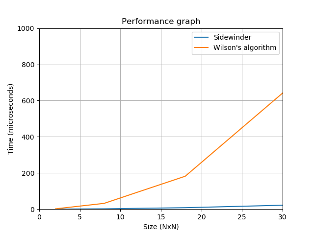
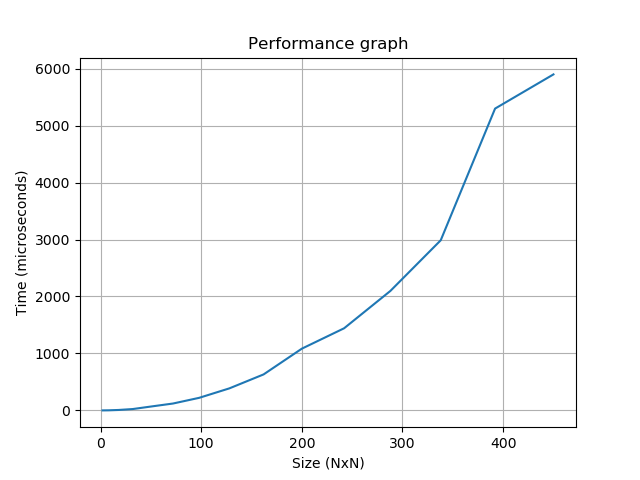
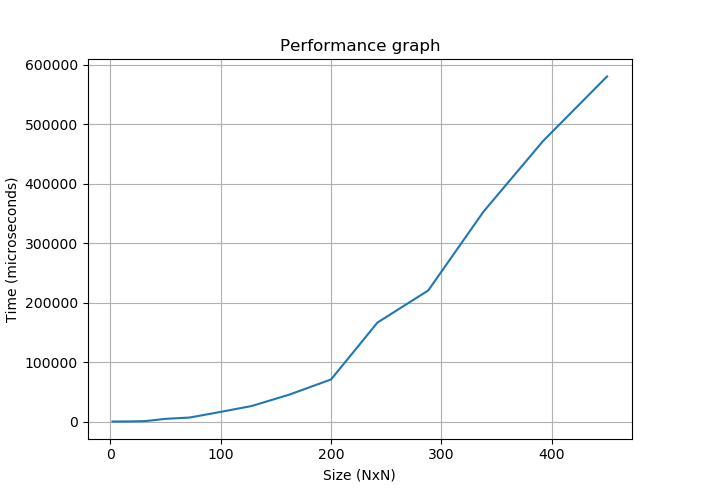

## Tehokkuustestit

Ohjelman käyttöliittymä mahdollistaa tehokkuustestien suorittamisen ohjelman suorituksen aikana.
Tehokkuustestauksesta vastaava luokka luo normaalitapauksessa 15 erisuuruista labyrinttia,
testaa algoritmien suorituksen jokaisella 5 kertaa ja laskee keskiarvon suoritusajoista
jokaiselle erisuuruiselle labyrintille

Tester-luokka luo labyrinttien seinien pituudet (NxN) kaavalla
$$2(i + 1)^2 \text{ , jossa  } 1 \le i \le N$$ ja $$10 \le N \le 20$$ riippuen testitapauksen laajuudesta

    Sidewinder on teoreettiselta aikavaativuudeltaan O(n²)
    Wilsonin algoritmi on teoreettiselta aikavaativuudeltaan O(n^n)

### Saavutetut tulokset tehokkuustestauksessa:

Algoritmien vertailu keskenään suorituskyvyn perusteella ei ole kovin oleellista, sillä saavutetut
tehokkuudet ovat hyvin vahvasti eri skaalaa jo pienillä labyrintin suuruuksilla (> 30x30):  

Sidewinderin aikaskaalautuvuus 2x2 - 400x400 kokoisten labyrinttien generoimisessa:

Wilsonin algoritmin aikaskaalautuvuus 2x2 - 400x400 kokoisten labyrinttien generoimisessa:

## Labyrintin generointimenetelmien vertailu

### Samankaltaisuudet labyrinteissa

Wilsonin ja Sidewinderin luomat labyrintit luovat labyrintteja, joissa jokaiseen ruutuun labyrintin sisällä pystyy kulkemaan, eikä "suljettuja alueita" synny labyrintin alueen sisälle.

### Erot labyrinteissa

#### Sidewinder

Esimerkkitapaus sidewinderin luomasta labyrintista:

    _____________________
    __  __  __  ______  |
    |     |___|       | |
    | | |  _|__ | | |_|_|
    | |_| |    _| |__  _|
    | |__ | |_|   |__   |
    | |  _|_|__ |_|  _| |
    | |  _|  ____ |__ |_|
    | |   |__  _|_|    _|
    |_|_|_|  ___|   |  _|
    |___________|_|_|____

Sidewinderin ensimmäinen rivi on aina suora käytävä, sillä algoritmi liikkuu rivi kerrallaan käyden jokaisen ruudun läpi ja liikkuu aina "oikealle tai ylöspäin", joista jälkimmäiseen liikkuminen ensimmä>

Sidewinderin luoma labyrintti luo polkuja vain ylöspäin, joten se ei pysty luomaan ylöspäin suuntaavaa umpikujaa, eli esim. alla olevan esimerkin tyyppistä polkua:

       _
      | |
    _ | |
    _ _ |

Tästä syystä luodun labyrintin ratkaisu on erityisen helppoa kuljettaessa labyrinttia "väärinpäin", eli uloskäynnistä lähtöruutuun, jos kuljetaan aina ylöspäin kun mahdollista.

#### Wilson's Algorithm

Wilsonin algoritmin luoma labyrintti on monimutkaisempi ja perustuu satunnaisista ruuduista johdettuihin polkuihin.
Wilsonin algoritmi on suoritustehokkuudeltaan hyvin paljon hitaampi, mutta voi luoda hyvinkin monimutkaisia labyrinttirakenteita.
