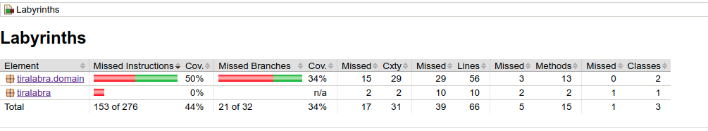
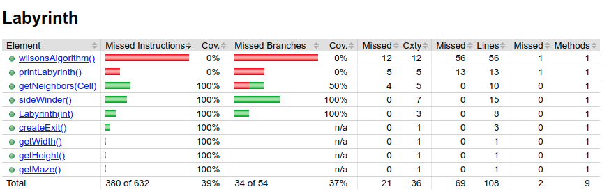
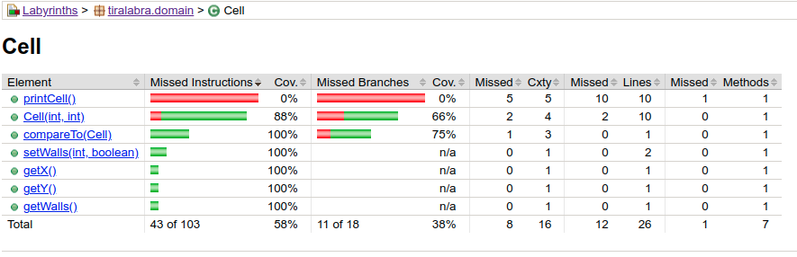
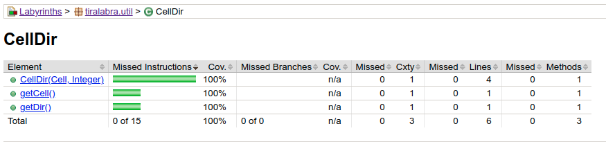
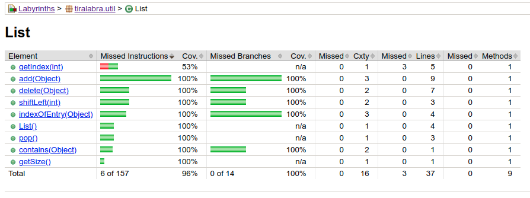

# Testikattavuusraportti

Testikattavuusraportin voi luoda jacocon avulla ohjelman rakentamisen yhteydessä.
Raportti ilmestyy polulle: `LabyrinthTest/Labyrinths/build/reports/jacoco/test/html/index.html`

Testikattavus valittaa etenkin `printCell()` ja `printLabyrinth()` funktioista, jotka jätin 
tarkoituksella testaamatta. Funktiot vastaavat käyttöliittymästä.

Main-luokkaa ei ole testattu, mikä on suurin testikattavuudesta valittava osa-alue. Jätin Main 
luokan testaamatta, sillä se vastaa käyttöliittymästä

Sidewinderin ja Wilsonin algoritmin testaus perustuu siihen, että luodun labyrintin jokaisessa ruudussa on mahdollista
käydä

## Koko ohjelma-alueen testikattavuus

## Labyrinths.domain

### Labyrinths.domain.Labyrinth

### Labyrinths.domain.Cell

## Labyrinths.util

### Labyrinths.util.Cell

### Labyrinths.domain.List

