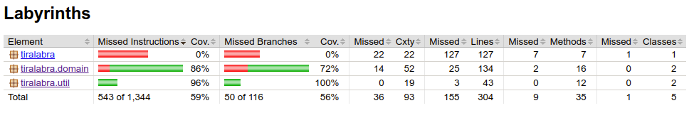
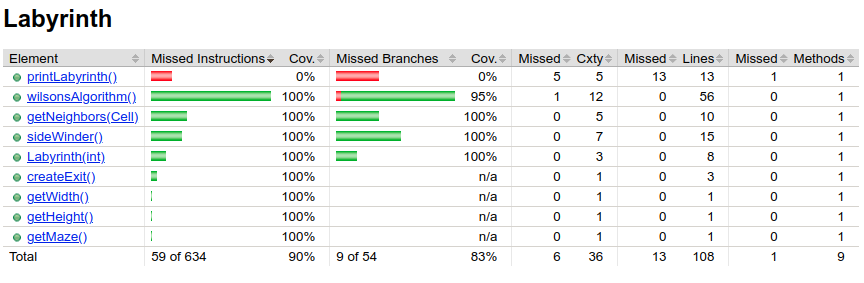

# Testikattavuusraportti

Testikattavuusraportin voi luoda jacocon avulla ohjelman rakentamisen yhteydessä.
Raportti ilmestyy polulle: `LabyrinthTest/Labyrinths/build/reports/jacoco/test/html/index.html`

Testikattavus valittaa etenkin `printCell()` ja `printLabyrinth()` funktioista, jotka jätin 
tarkoituksella testaamatta. Funktiot vastaavat käyttöliittymästä.

## Koko ohjelma-alueen testikattavuus

## Labyrinths.domain

### Labyrinths.domain.Labyrinth

### Labyrinths.domain.Cell

## Labyrinths.util

### Labyrinths.util.Cell

### Labyrinths.domain.List

